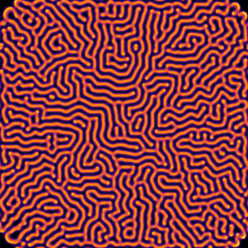
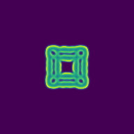
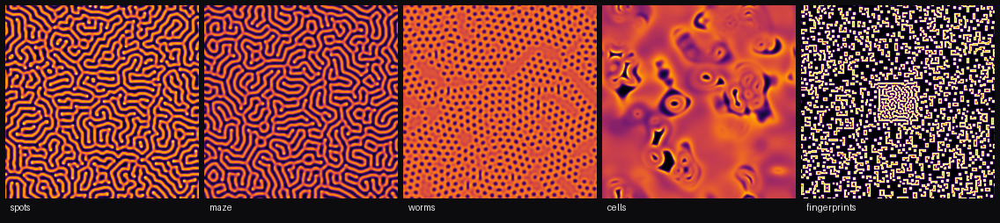
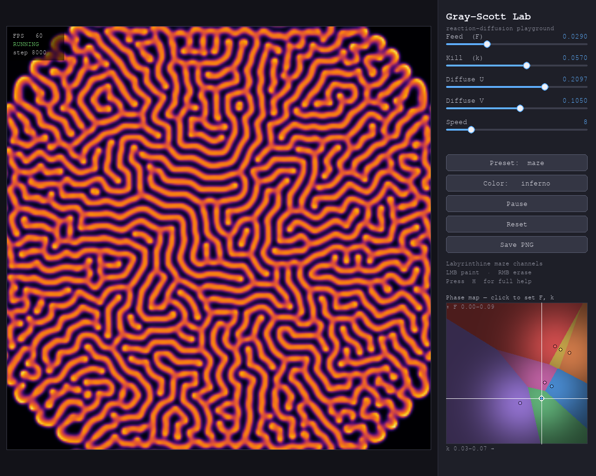

# Gray-Scott Lab

An interactive real-time simulation of **Gray-Scott reaction-diffusion patterns** : a class of Turing instabilities that generate the spots, stripes, and labyrinthine shapes found throughout nature.

<p align="center">
  
</p>

<p align="center">
  
</p>

> The images above are produced by [`generate_pics.py`](generate_pics.py) : see [Generating artwork](#generating-artwork).

---

## What is this?

Gray-Scott Lab is a Python application that simulates two chemicals (U and V) diffusing and reacting on a 2D grid in real time. By adjusting just two parameters (F and k), the system self-organises into strikingly different patterns: leopard spots, coral branches, fingerprint ridges, cellular structures, and more.

The simulation runs at 60 fps in a fullscreen window with an **interactive control panel** (drag sliders to tune the model live), mouse injection, vibrant colormaps, and live preset switching.

### Highlights

- **Live control panel** : drag sliders for Feed (F), Kill (k) and the two diffusion rates and watch the pattern morph instantly; buttons to cycle presets/colormaps, pause, reset, and save.
- **Phase-space map** : a clickable (F, k) diagram of the parameter space — each region is tinted by its nearest preset, a crosshair tracks the current params, and clicking jumps there live. Navigate the pattern zoo by exploring the map instead of guessing numbers.
- **Optional GPU backend** : `--gpu` runs the whole update as one fused [Taichi](https://www.taichi-lang.org/) kernel — **~100× faster** than the NumPy core, enough for 1024×1024 grids well above 60 fps. Falls back to NumPy when Taichi isn't installed. See [Performance](#performance).
- **Fullscreen by default** : the simulation auto-fits the screen next to the panel (use `--windowed` for a resizable window).
- **Vibrant colormaps** : perceptual maps (inferno, magma, plasma, viridis, turbo, twilight) via matplotlib, plus hand-coded ones (fire, neon, toxic, ocean, grayscale).
- **Paint with the mouse** : left-drag to inject the V chemical, right-drag to erase.

<p align="center">
  
</p>
<p align="center"><sub>Five presets grown from random noise — left to right: spots, maze, worms, cells, fingerprints.</sub></p>

---

## Mathematical Background

The Gray-Scott model is a system of two coupled reaction-diffusion PDEs:

```
∂U/∂t = Du · ∇²U  −  U·V²  +  F·(1 − U)
∂V/∂t = Dv · ∇²V  +  U·V²  −  (F + k)·V
```

**Reading the equations term by term:**

| Term | Meaning |
|---|---|
| `Du·∇²U`, `Dv·∇²V` | **Diffusion** — each chemical spreads out, smoothing local gradients. |
| `−U·V²` / `+U·V²` | **Reaction** — the autocatalytic step `U + 2V → 3V`: one U and two V produce three V. It removes U and creates V, and is quadratic in V, so it only fires where V is already present. |
| `+F·(1 − U)` | **Feed** — U is replenished toward 1 at rate `F` (the "food" supply). |
| `−(F + k)·V` | **Kill** — V is removed at rate `F + k`, so V decays unless the reaction keeps feeding it. |

**Intuition:**
- `U` is a "food" chemical, continuously supplied at rate `F`.
- `V` is an "activator" that consumes U autocatalytically and decays at rate `F + k`.
- The two species diffuse at different rates: `Du > Dv`, meaning U spreads faster than V. This **differential diffusion** is what makes patterns possible (see Turing, below).
- The uniform state `U = 1, V = 0` is always an equilibrium. Patterns are what happens when a perturbation to that state grows instead of dying — a balance between the reaction creating V and diffusion + kill erasing it.

**The Laplacian `∇²`** is approximated on a discrete grid with a weighted 3×3 stencil:

```
[ 0.05  0.20  0.05 ]
[ 0.20  -1.0  0.20 ]
[ 0.05  0.20  0.05 ]
```

This stencil sums to zero (a valid Laplacian) and uses periodic boundary conditions (the grid wraps toroidally).

**Numerical integration.** Time is advanced with an explicit **forward-Euler** step of size `Δt = 1` (folded into the diffusion constants), updating every cell in parallel:

```
Uₙ₊₁ = Uₙ + Δt · ( Du·∇²Uₙ − Uₙ·Vₙ² + F·(1 − Uₙ) )
Vₙ₊₁ = Vₙ + Δt · ( Dv·∇²Vₙ + Uₙ·Vₙ² − (F + k)·Vₙ )
```

Both fields are clamped to `[0, 1]` each step for numerical safety. Explicit diffusion is only stable when the diffusion term is small enough per step (the usual `D·Δt ≤ ¼` CFL-type bound for a 2-D 5-point stencil); the preset constants stay comfortably inside it, which is why each on-screen frame integrates several sub-steps (the **Speed** slider) rather than one big step. This per-cell, neighbours-only update is **embarrassingly parallel**, which is exactly what the [GPU backend](#performance) exploits.

**Parameters F and k:**

| Parameter | Role | Effect of increasing |
|---|---|---|
| `F` (feed rate) | Rate at which U is replenished | More energy → larger, more active patterns |
| `k` (kill rate) | Rate at which V is removed | Higher k kills V faster → patterns shrink or disappear |

Small changes in (F, k) produce qualitatively different morphologies. The parameter space has been mapped empirically and the presets correspond to well-known stable regions.

**Connection to Turing patterns and morphogenesis:**

Alan Turing proposed in 1952 (*"The Chemical Basis of Morphogenesis"*) that pairs of diffusing chemicals : one activating itself and inhibiting the other, the other doing the reverse : could spontaneously break spatial symmetry and form stable periodic patterns. This is now called a **Turing instability**.

Gray-Scott is one of the cleanest examples: V activates itself (`U·V²` term), U is the inhibitor that gets consumed. The crucial ingredient is the **diffusion ratio** `Du/Dv > 1`: the inhibitor must diffuse faster than the activator, which prevents any local dominance from spreading too fast. The interplay between reaction and differential diffusion drives the system away from the uniform state and into the rich pattern space you see here.

These mechanisms appear in real biology: skin pigmentation (zebrafish stripes), hair follicle spacing, digit formation in embryos, and seashell patterns are all believed to involve Turing-like instabilities.

---

## Installation

```bash
git clone https://github.com/JulienExr/GrayScottLab.git
cd GrayScottLab
pip install -e ".[dev]"
```

Or without editable install:
```bash
pip install -r requirements.txt
```

**Optional GPU backend** (for `--gpu`):
```bash
pip install -e ".[gpu]"     # pulls in Taichi
```
Taichi ships its own runtime and selects a backend automatically — CUDA on an NVIDIA GPU, Vulkan on an Intel/AMD iGPU, or CPU as a fallback — so no CUDA toolkit install is required.

**Requirements:** Python 3.10+, pygame 2.5+, numpy 1.24+ (Taichi 1.7+ optional, for `--gpu`)

---

## Usage

```bash
python main.py
```

If installed with `pip install -e .`, a `grayscott` command is also available:

```bash
grayscott --preset coral
```

The app launches **fullscreen** by default. Press `ESC` to quit.

**CLI options:**

| Flag | Default | Description |
|---|---|---|
| `--size N` | 256 | Grid size N×N |
| `--preset NAME` | spots | Starting preset |
| `--steps N` | preset default | Simulation steps per frame |
| `--seed N` | random | Random seed for reproducibility |
| `--windowed` | off | Run in a resizable window instead of fullscreen |
| `--gpu` | off | Use the Taichi GPU backend (requires the `gpu` extra) |

**Examples:**
```bash
python main.py --preset coral
python main.py --preset fingerprints --size 320
python main.py --preset spots --seed 42 --windowed
python main.py --size 1024 --gpu          # large grid, real-time on a GPU
```

---

## Controls

Everything is reachable from the on-screen **control panel** (right side), but
keyboard and mouse shortcuts are available too:

<p align="center">
  
</p>

| Control | Action |
|---|---|
| **Sliders** | Tune Feed (F), Kill (k), Diffuse U/V, and Speed live |
| **Phase map** | Click/drag the (F, k) diagram to jump anywhere in parameter space |
| **Buttons** | Cycle preset / colormap, Pause, Reset, Save PNG |
| `SPACE` | Pause / resume |
| `R` | Reset simulation |
| `S` | Save screenshot to `outputs/` |
| `P` | Cycle to next preset |
| `C` | Cycle to next colormap |
| `+` / `-` | Increase / decrease steps per frame |
| `H` | Toggle on-screen help overlay |
| `ESC` | Quit |
| **Left click** (hold/drag) | Inject chemical V (seed new pattern) |
| **Right click** (hold/drag) | Erase V, restore U (clear region) |

> Editing a slider changes the model immediately without resetting the grid, so
> you can watch one pattern continuously morph into another. Press **Reset** (or
> `R`) to re-seed the grid; your slider values are kept.

---

## Performance

The update is purely local — every cell only reads its 8 neighbours — so it parallelises perfectly. Two interchangeable backends share one API (`reaction_diffusion.create_simulation(..., backend=...)`):

- **`cpu`** (default) — pure NumPy. The Laplacian is a weighted `np.roll` stencil; portable, zero extra dependencies.
- **`gpu`** (`--gpu`) — [Taichi](https://www.taichi-lang.org/). The Laplacian, reaction and clamp are **fused into a single kernel** with one launch per step (vs. NumPy's ~30 array ops), double-buffered to update every cell in parallel.

Measured on an RTX 4070 Laptop GPU, 1024×1024 grid, 10 sub-steps per frame (device→host readback included):

| Backend | ms / frame | fps | Speed-up |
|---|---:|---:|---:|
| NumPy (CPU) | ~337 | ~3 | 1× |
| **Taichi (CUDA)** | **~3.3** | **~300** | **~100×** |

That headroom is what makes 1024×1024 comfortably real-time. Taichi auto-selects CUDA / Vulkan / CPU, so `--gpu` also accelerates machines without an NVIDIA card; it degrades gracefully to the NumPy path when Taichi isn't installed.

---

## Presets

| Name | F | k | Character |
|---|---|---|---|
| `spots` | 0.0365 | 0.0600 | Isolated circular spots |
| `maze` | 0.0290 | 0.0570 | Labyrinthine maze channels |
| `coral` | 0.0580 | 0.0650 | Branching coral structures |
| `worms` | 0.0390 | 0.0580 | Squiggly worm-like patterns |
| `cells` | 0.0260 | 0.0510 | Cell division dynamics |
| `unstable` | 0.0620 | 0.0609 | Chaotic, constantly shifting |
| `fingerprints` | 0.0600 | 0.0625 | Dense parallel ridges |

All presets use `Du=0.2097, Dv=0.1050` except `fingerprints` (`Du=0.19, Dv=0.05`).

---

## Colormaps

Cycle them live with `C` or the **Color** button.

Perceptual (via matplotlib, fall back gracefully if not installed):
- **inferno**, **magma**, **plasma**, **viridis** : smooth perceptual gradients
- **turbo** : high-contrast rainbow
- **twilight** : cyclic blue↔red

Hand-coded:
- **fire** : black → red → yellow → white
- **neon** : magenta → cyan → bright
- **toxic** : black → acid green
- **ocean** : deep blue → teal → white
- **grayscale** : clean, neutral, scientific

---

## Project Structure

```
GrayScottLab/
├── main.py                    Entry point + game loop
├── generate_pics.py           Headless still/GIF generator for the README
├── reaction_diffusion/
│   ├── simulation.py          GrayScottSimulation class (NumPy core)
│   ├── simulation_taichi.py   TaichiGrayScottSimulation (fused GPU kernel)
│   ├── __init__.py            Package exports + create_simulation() factory
│   ├── presets.py             Preset dictionary + helpers
│   ├── renderer.py            Pygame renderer, viewport + HUD
│   ├── ui.py                  Slider / Button / PhaseMap / Panel widgets
│   ├── colormaps.py           LUT colormaps (V → RGB)
│   ├── controls.py            AppState + event handling
│   └── utils.py               File I/O + coordinate helpers
├── tests/
│   ├── test_simulation.py
│   ├── test_simulation_taichi.py   GPU backend (auto-skipped without Taichi)
│   ├── test_ui.py                  PhaseMap mapping + Panel wiring
│   ├── test_presets.py
│   └── test_colormaps.py
└── outputs/                   Screenshots saved here
```

---

## Running Tests

```bash
pytest tests/ -v
```

---

## Generating artwork

The still and animation at the top of this README are generated headlessly
(no display required) from the simulation itself:

```bash
pip install -e ".[dev]"   # pulls in Pillow
python generate_pics.py
```

This writes `outputs/hero.png` (a developed `maze` pattern),
`outputs/evolution.gif` (a `worms` pattern spreading from the seed), and
`outputs/gallery.png` (the five-preset montage shown above). Edit the
`main()` call in `generate_pics.py` to choose other presets, colormaps, sizes,
or frame counts.

---

## Ideas for Future Improvements


1. **Adjustable brush + seed shapes** : a brush-size slider and circle/line/image seed masks for more expressive initial conditions and painting.

2. **Multispecies models** : extend to 3-species systems (e.g., Oregonator, Brusselator) to access richer pattern classes including spirals and travelling waves.


---